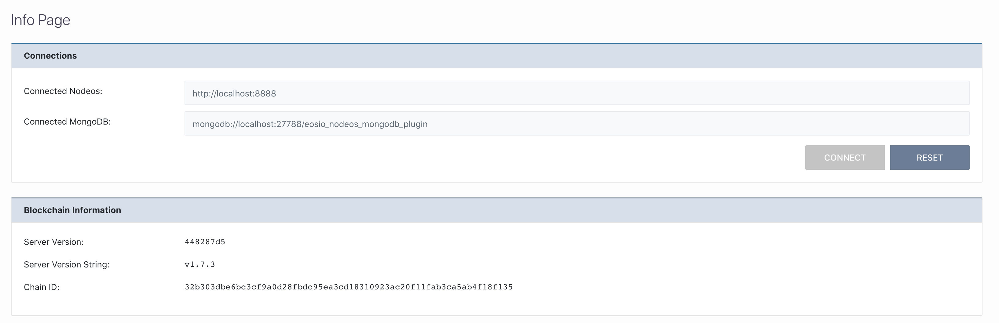

[Home](../..) > Guides > [Managing Connections](README.md) > Establishing New Connections

# Establishing New Connections

When you first open the tool, you will first see the Info Page. After closing the welcome message, you will immediately be able to see the information regarding the `nodeos` instance you are connected to:

You can change this by replacing the input fields specified by "Connected Nodeos" and "Connected MongoDB" to whatever you choose.

:warning: - For demonstration purposes, the endpoints shown in this guide have been redacted. 

## Changing the Endpoints

After replacing the text to endpoints of your choosing, the "Connect" button will no longer be disabled:

After clicking the "Connect" button, you will be asked to **confirm** if you wish to change your connection or not, since you will lose all currently stored private keys. 

:warning: Disclaimer :warning:

1. Be **very certain** that your connected `nodeos` and MongoDB endpoints match one another, otherwise you might encounter some problems regarding mismatched block data and/or permissions.
2. Changing the connection **will clear your locally stored private keys** so please back them up in advance if you need to.

## Successful Connection 

After successfully changing the connection, your screen will refresh and reflect the data coming from the new endpoint:

