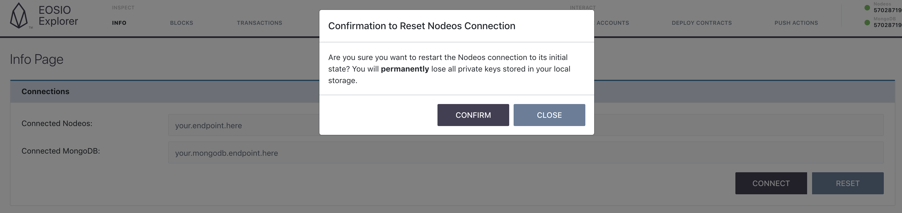
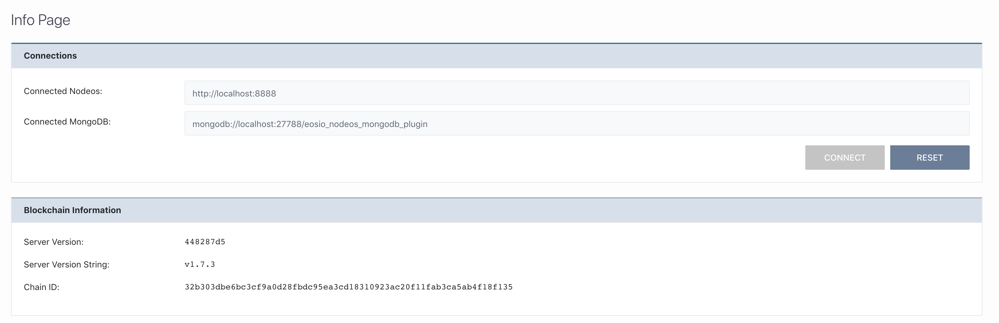

[Home](../..) > Guides > [Managing Connections](README.md) > Resetting the Connection

# Resetting the Connection

If you want to reset your connection at any point in time, you can simply click the "Reset" button next to the "Connect" button. A prompt will appear asking you to confirm:

Clicking "Confirm" will reset your connections to the default:

