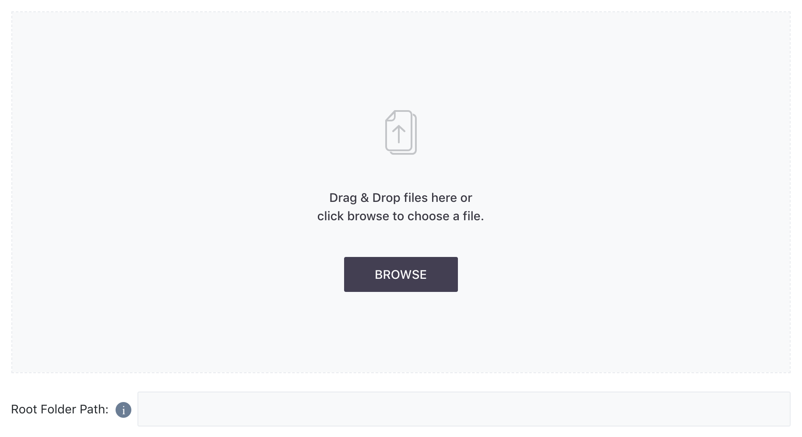
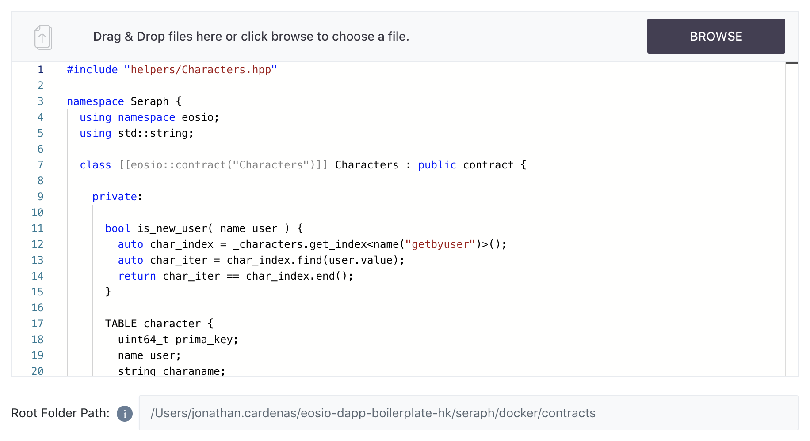

[Home](../..) > Guides > [Deployment](README.md) > Step 1

Step 1: Select File Entry Point --> [Step 2: ABI File (Optional)](step-two.md) --> [Step 3: Deploy](step-three.md)

# Step 1: Select File Entry Point

The first step takes place within the panel indicated as "Select File Entry Point." The intructions indicated in the [index](README.md) are also visible in this page.

You should see a blank portion where you can drag and drop a `.cpp` file or browse for it with the file viewer as follows:

## Select File and Enter Root Folder Path

In this section you must specify two things:

1. The file which contains the main entry source for the compiler
2. The folder that contains the file in (1) and its dependencies.

The root folder **must** be written as an absolute file path, as the compiler performs compilation locally in your machine and must be able to access your file system.

For demonstration purposes, assume we are a user, `test.account`, who wants to deploy or compile a contract named `Characters`. 

We would need to pass a file, in this case called `Characters.cpp`, and also pass the absolute folder path containing this file. In this case, the file is in: `/Users/jonathan.cardenas/eosio-dapp-boilerplate-hk/seraph/docker/contracts`.

The section would look like this:

:warning: Disclaimer :warning:

1. The file you select in this dropzone will be treated as the entry file point and point of reference for all local dependencies by the compiler.
2. The root folder path you specify in the input field will be treated as the **root** directory of the smart contract source code.
3. Be sure to organize your files and folders properly so that they are correctly found.
4. **If you update the `.cpp` file you're using in this section, you do NOT need to enter the file in this section again**. The compiler will use the latest version of your `.cpp` file
5. If you want to supply `~` in your folder file path, **make sure** your `HOME` directory is correct. The compiler service is implemented in Node.JS and thus natively does not support `~` (which is a `bash` construct). Therefore, the service will substitute `~` for the value of `process.env.HOME`.

After verifying, move on to either [Step Two](step-two.md) or if you do not need to import an ABI file and do not wish to verify the compiled ABI file, move straight to [Step Three](step-three.md).
