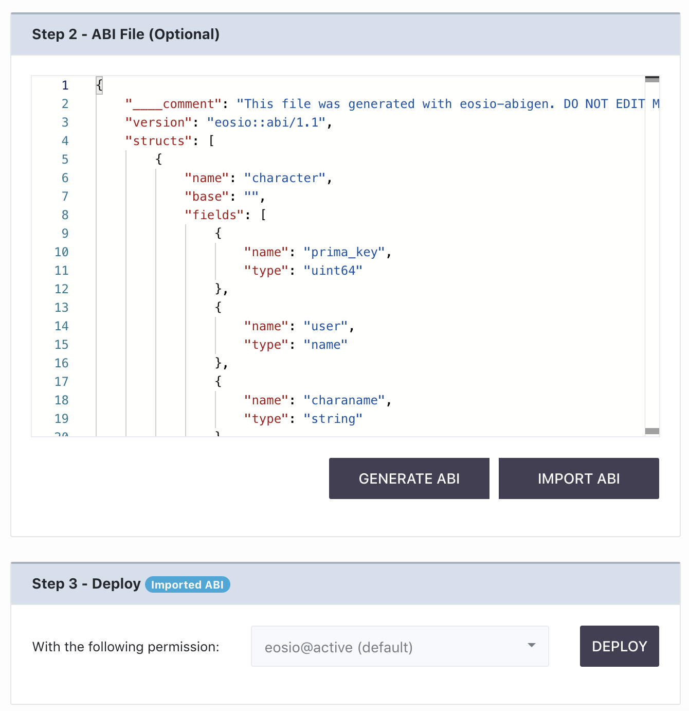
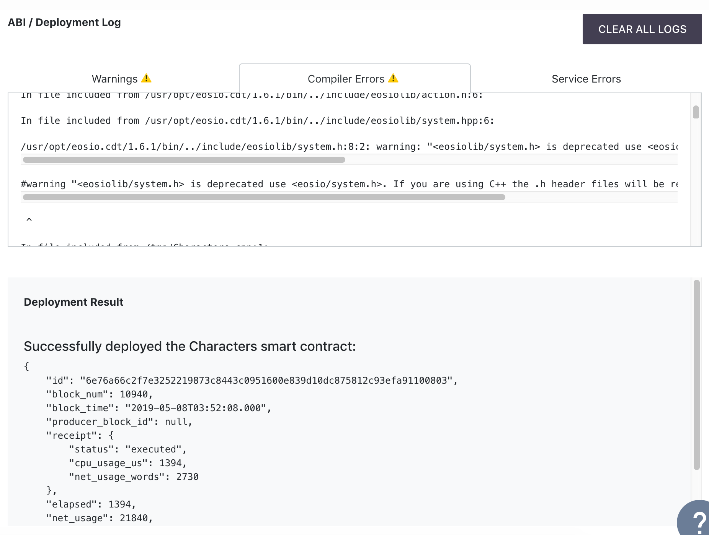

[Home](../..) > Guides > [Deployment](README.md) > Step 2

[Step 1: Select File Entry Point](step-one.md) --> [Step 2: ABI File (Optional)](step-two.md) --> Step 3: Deploy

# Step 3: Deploy

Whether you have decided to skip [Step Two](step-two.md) or not, you will need to deploy your smart contract.

Assuming we would like to deploy the smart contract named `Characters`, with our own `Characters.abi` file imported, the screen should indicate the following:

Under the Step 3 panel header, you can choose with the dropdown menu which permission to deploy the smart contract under.

:warning: Disclaimer :warning: - If you are running this in your own local `nodeos` instance which ships with this tool, you will not be able to deploy as `eosio` because it currently uses the EOSIO blockchain system contracts which are critical to performing actions such as creation of new accounts.

After clicking Deploy, the compiler will try to do one of two things depending on whether you did [Step Two](step-two.md) or not.

If you went to Step Two:

* The compiler will re-generate the `.abi` and `.wasm` files, if successful it will deploy to the blockchain using `setabi` and `setcode` from the system contracts. This occurs if you did not import an ABI file.
* If you imported an ABI file, the compiler will use the provided ABI file instead of the generated `.abi` file, but will still use the generated `.wasm` file. If generation of the `.wasm` file is successful, deployment moves on as normal.

If you skipped Step Two, the compiler will simply just create the `.abi` and `.wasm` files and deploy if successful. You should only do this if you are sure your smart contract produces a valid `.abi` file.

A successful deployment should show the following in the 'Deployment Result' section:

Sometimes, your smart contract will deploy successfully despite warnings from the compiler service. You can still review these warnings and update your smart contract accordingly.
