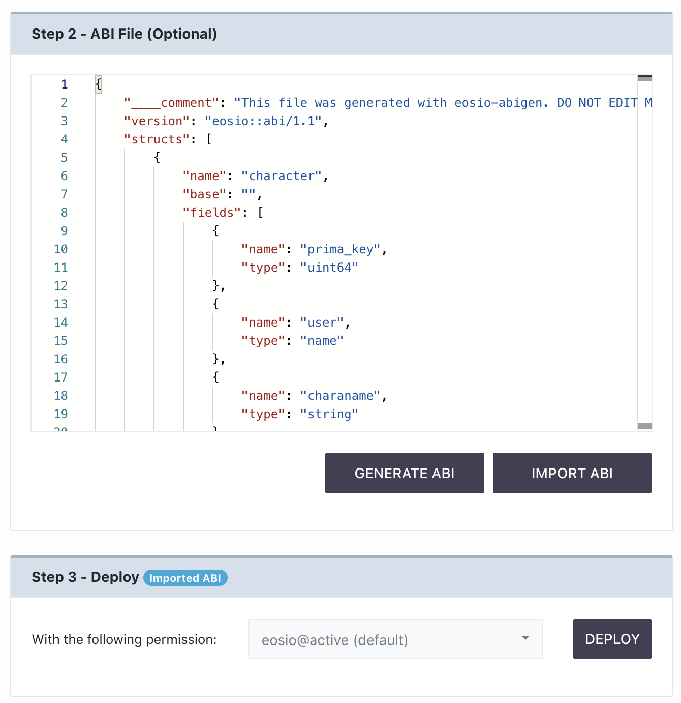

[Home](../..) > Guides > [Deployment](README.md) > Step 2

[Step 1: Select File Entry Point](step-one.md) --> Step 2: ABI File (Optional) --> [Step 3: Deploy](step-three.md)

# Step 2: ABI File (Optional)

After specifying your file entry point as in [Step One](step-one.md), you can scroll down to move to Step 2, where you will see the following:

If you want to deploy right away, you can ignore this page and move to [Step Three](step-three.md). If you want to check if you can generate the ABI file from your smart contract, read further.

## Generate the ABI File for Verification

Clicking the "Generate ABI" button will cause the compiler to receive the entry file you specified in [Step One](step-one.md), as well as any other `.cpp` or `.hpp` files in the folder you provided. The compiler will then attempt to use `eosio-cpp` under the hood to generate a `.wasm` and `.abi` file. If both files are available, the compilation is successful and the contents of the `.abi` file are given to the tool to display. It will look something like this:

In the section adjacent to this panel, logs for compilation and/or deployment are also available for viewing. If there are warnings or errors originating from the compiler, they will be presented in this section as follows:

## Import the ABI File for Deployment

Sometimes, the ABI file you generate won't be correct, or you wish to use a file that you have prepared in advance instead. Then you can click "Import ABI" instead to have the compiler use your imported ABI file:

After supplying the desired `.abi` file, the import should be successful and your view will change:

A pill next to the panel for [Step Three](step-three.md) will denote that you are using an imported ABI file. 

You can now proceed to [Step Three](step-three.md) to deploy your smart contract.
