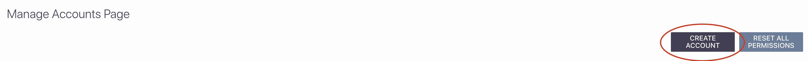
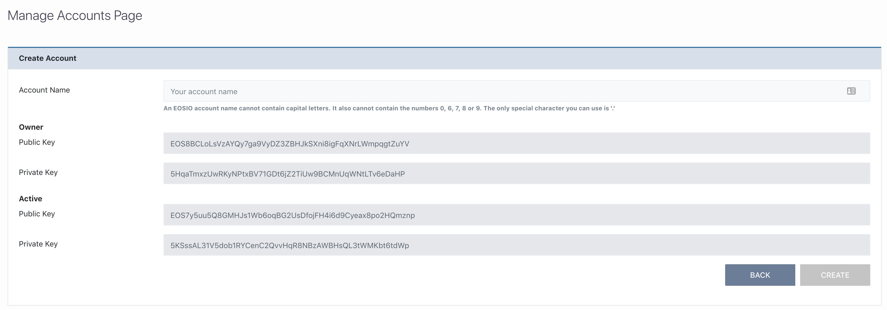

[Home](../..) > Guides > [Managing Accounts](README.md) > Create Account

# Create Account 

To create an account, inside the [Manage Accounts Page](../../pages/interact/manage-accounts-page.md), you need to click the "CREATE ACCOUNT" button as displayed below:

## Creating the Account

After clicking the button you will see a panel that looks like this:

All you need to do is enter an account name in the field based on the following restrictions:

* The name cannot start with a capital letter
* In fact, the name cannot contain any capital letters. Lower case only please (`[a-z]`)
* The only numbers you can use are the numbers `1` to `5`
* The only special character you can use is `.`

Starting your account name with an illegal character will be escaped by the blockchain and turned into `.`, otherwise they get ignored completely.

## On Success

On successfully creating the account, you will be able to see it in your list of permissions that you can set as default, as follows:

