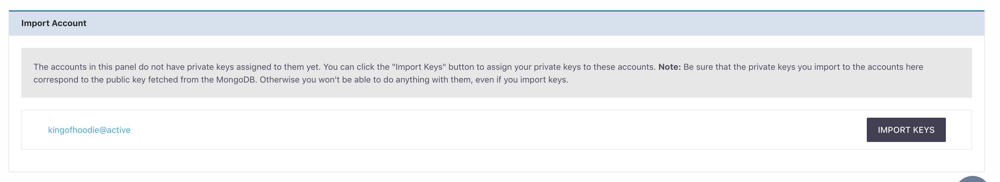
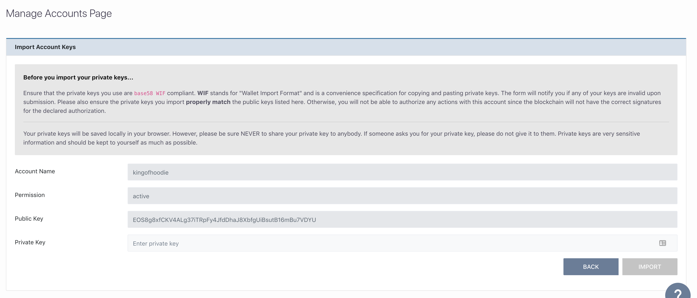
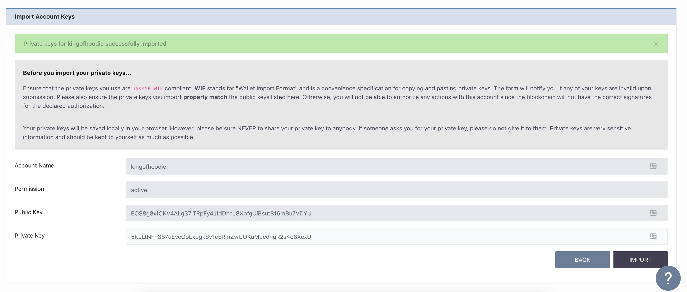

[Home](../..) > Guides > [Managing Accounts](README.md) > Import Account Keys

# Import Account Keys

Sometimes, you will be working in a team for your application on the EOSIO blockchain. In this scenario, it is likely that you will see accounts owned by other users.

Alternatively, you are using the tool to work on multiple nodes and are only connected to one of them at a time. The tool stores private keys **locally**, so every time you change your connected `nodeos` instance or reset your connection/permissions, you will lose the private keys currently stored in local storage. Therefore, be sure that you have backed up your keys prior to them so you can use this feature to import those keys and restore access to your account(s).

The account list will be visible in a panel as shown below:

After checking which account you want to import keys for, click the "IMPORT KEYS" button corresponding to that account.

## Importing Keys

After clicking the button, you will see a panel that looks as follows:

The fields to enter your private keys will likely be empty. You will have to enter your private keys here, though the import will fail **if your private keys does not properly match the public keys displayed**.

Finally, you should ensure your private keys are in `base58 WIF` format. `WIF` is short for `Wallet Import Format` and makes it easier for users to copy and paste these types of private keys.

:warning: Disclaimer :warning:

1. Any keys shown in this guide are **purely** for demonstration purposes. Do not use them for your own purposes.
2. Do not blindly share your private keys with anyone else, or leave them exposed.
3. **For development purposes**, if your keys are freely shared, keep in mind keys can be changed at any time. If your keys get lost due to someone else replacing the public key, you may or may not be able to get the replacement private key. 

### On Success

After successfully importing the keys, you will see the success messsage:

Afterwards, you can see the new permission in the main list of permissions.
