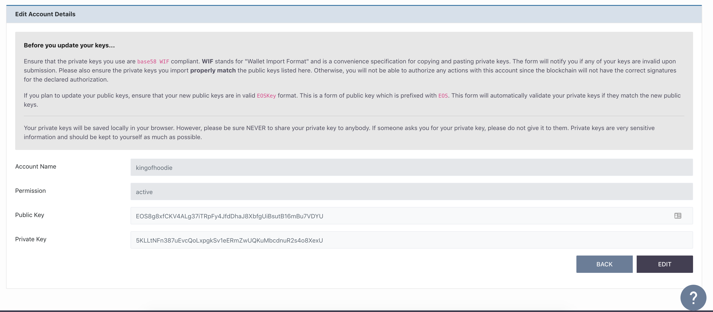
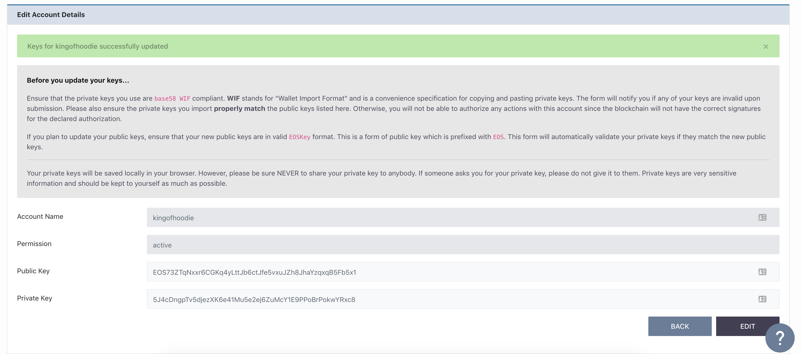

[Home](../..) > Guides > [Managing Accounts](README.md) > Update Account Keys

# Update Account Keys

For any number of reasons, you may find it desirable to change the public keys of your account, especially in cases of compromised private keys. 

While this is a development tool, this possibility should never be discounted.

In the Default Signature Account panel, you can see the list of accounts with public keys that you can change:

After checking which account you want to update, click the "EDIT" button corresponding to that account.

## Updating Keys

For instance, let us assume you want to update an account with the name `dragonfruit`. You would click the "EDIT" button corresponding to the `dragonfruit` account, which would take you to this panel:

:mag_right: 

From here, there are three possible things you can do:

1. Update only the public key of the `active` permission
2. Update only the public key of the `owner` permission
3. Update both `active` and `owner` public keys

If you decide to click "SUBMIT" without changing anything, the form will inform you that the keys have not changed and thus no action will be performed.

:mag_right:

For purposes of this guide, let's assume you want to change both `active` and `owner` keys like this:

:warning: - The form will check if your public and private keys are valid. It will also check if the private keys you supply correctly match the new public key that you have used.

### On Success

After pressing "SUBMIT", if the update has succeeded, you will see the success message:

If you want to verify that the action has really gone through, you can either check the [action list page](../../pages/action-list-page.md) for `updateauth` actions or check the latest transactions in the [transaction list page](../../pages/transaction-list-page.md). Transactions that have modified your public keys should contain one `updateauth` action if you have only modified one key and two `updateauth` actions if you have modified both keys. 
