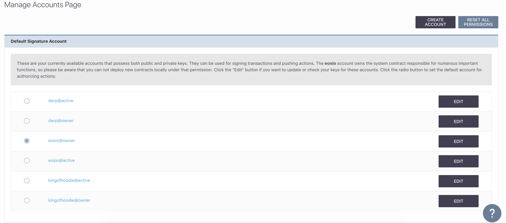

[Home](../..) > Guides > [Managing Accounts](README.md) > Update Account Keys

# Update Account Keys

For any number of reasons, you may find it desirable to change the public keys of your account, especially in cases of compromised private keys. 

While this is a development tool, this possibility should never be discounted.

In the Default Signature Account panel, you can see the list of accounts with public keys that you can change:

After checking which account you want to update, click the "EDIT" button corresponding to that permission.

:warning: - The default `eosio` account created using our tool **CAN** be edited, but do so at your own risk. The tool is only responsible for retaining the private key of the default public key provided with this tool. If you change the public key, **you** are now responsible for the private key of the account. 

## Updating Keys

For instance, let us assume you want to update an account with the name `kingofhoodie`, and you want to change the active key of the account. You would select the "EDIT" button corresponding to the `kingofhoodie@active` permission:

You can then provide a new public and private keypair for this permission. Please verify that the permission you are changing is the correct one; it is visible in this form. 

### On Success

After pressing "SUBMIT", if the update has succeeded, you will see the success message:

If you want to verify that the action has really gone through, you can either check the [action list page](../../pages/action-list-page.md) for `updateauth` actions or check the latest transactions in the [transaction list page](../../pages/transaction-list-page.md). 
