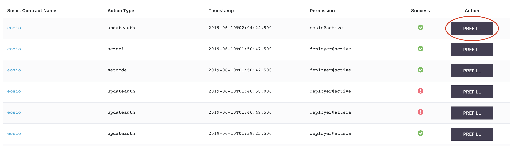

[Home](../..) > Guides > Pushing an Action

# Pushing an Action

There are likely two main reasons why you would like to push an action to the blockchain:

1. To test an action in a smart contract you have personally created and/or deployed
2. To test an action in a smart contract somebody else has deployed

In either case, it is imperative that the user can push such actions in a simple manner.

## How to Push an Action Manually

When you enter the Push Action Page, the first thing you should see is a panel containing an unfilled form:

There are four things you need to know before you can push an action:

1. Which smart contract do you want to use?
2. Which specific action from your answer in question 1 do you want to push?
3. Which permission should authorize this action?
4. The data you want to push to the blockchain as part of the action you specified in question 2

Simply fill out the form in accordance to your answers to the above queries. 

For example, if the answers to the questions above were as follows:

1. The `test.account` smart contract
2. The `upsert` action, which pushes a small packet of data consisting of a character with a name, level and life assigned to a user
3. The `test.account` account with the `active` permission
4. Data consisting of: A character named `LoremIpsum` with a level of `1` and a life value of `100`, assigned to the `test.account` user

Then the form would be filled as follows.

Then, you can click the "Push" button to push the action. If you change your mind, you can click "Clear" to reset all fields. If you leave the page by mistake, you can return to this page without losing any of the data you put into the fields.

## On Successful Push

Upon successfully pushing an action, you will see the following message:

You can view the [Action List Page](../../pages/action-list-page.md) to check that the action was pushed.

## The Action History Viewer and Pre-filling the Form

Sometimes, you want to continuously repeat an action, and just slightly adjust the parameters or change the permission used to authorize the transaction. Other times, you just don't want to keep filling in the form manually. You can accomplish pre-filling the Push Action form by looking at the Action History Viewer, which is directly below the Push Action panel. It looks like this:

Circled in red is the 'Prefill' button, which lets you automatically fill the Push Action form with the exact same information used to push the action indicated in the Action History Viewer. This gives you a convenient summary of previous actions. You can also control how many actions you show at once by changing the 'Show rows' dropdown from 100 to another value. Possible alternatives are: `25, 50, 75`. It is `100` by default.

For example, the action specified [previously](#how-to-push-an-action-manually), if we want to prefill the form with this data, we would find that action in the action history viewer and then click "Prefill," which would lead to the following:

You can proceed to edit the form at your leisure or push the action again to test its behavior.

## The Action History Viewer and Filtering by Smart Contract 

If you are working on a blockchain with many deployed smart contracts, there is a chance that many actions are being processed and authorized simultaneously. In this case, it may be nice to be able to filter the list of past actions for a specific smart contract, normally one you are developing or working with.

In the upper left corner of the panel, you can see a dropdown menu listing the currently available smart contracts with actions:

Here is what you should see if you, for instance, decided to check all actions belonging only to the `eosio` contract:

## Success Indicator

The Action History Viewer will list whether your action has been successfully pushed or not. If it failed, hovering over the failure icon will provide a tooltip that may tell you why the action failed. If the error is not known, then the tool will inform you that an error has occurred without specifying what the error actually was.

